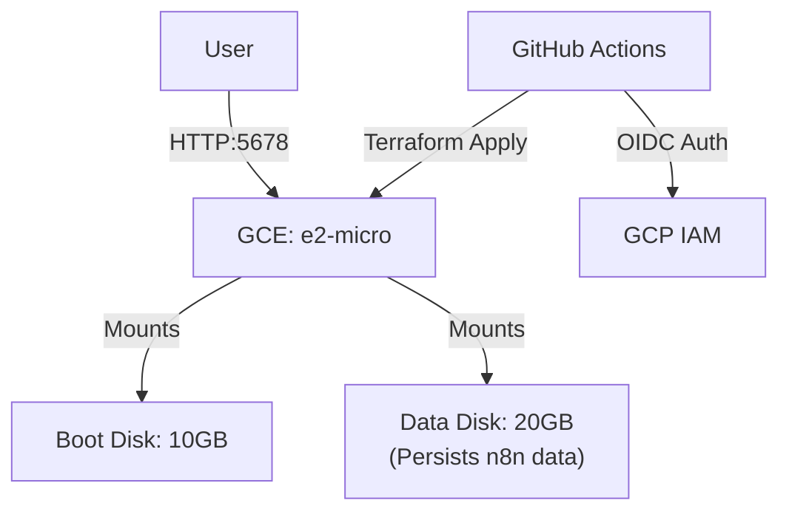

# GCP Free Tier n8n Self-Hosting with Terraform & GitHub Actions

This repository contains a complete Infrastructure as Code (IaC) setup to host [n8n](https://n8n.io/) on Google Cloud Platform (GCP) for **free** (using the Always Free tier).

It uses **Terraform** for infrastructure management and **GitHub Actions** with **Workload Identity Federation (OIDC)** for secure, keyless deployment.

## Architecture

To ensure data persistence while staying within the free tier (30GB total disk), we split the storage:

*   **Compute**: `e2-micro` instance (2 vCPUs, 1GB RAM) - Free in us-central1/us-east1/us-west1.
*   **Boot Disk**: 10GB Standard Persistent Disk (OS & Docker). Replaced on redeploy.
*   **Data Disk**: 20GB Standard Persistent Disk (n8n data). **Persists** across instance replacements.
*   **Network**: Ephemeral IP (Dynamic) to avoid static IP costs.
*   **Security**: OIDC Authentication (No long-lived JSON keys).



## Prerequisites

1.  **GCP Project**: Create a new Google Cloud Project.
2.  **Billing Enabled**: Billing must be enabled (required for using Cloud APIs), even for free tier.
3.  **GitHub Repository**: This code must be in a GitHub repository.

## Quick Start (Cloud Shell)

The easiest way to deploy is using Google Cloud Shell.

1.  **Open Cloud Shell** in your GCP Console.
2.  **Clone this repository**:
    ```bash
    git clone https://github.com/YOUR_USER/YOUR_REPO.git
    cd YOUR_REPO
    ```
3.  **Run the Setup Script**:
    ```bash
    chmod +x setup.sh
    ./setup.sh
    ```
    *   The script will ask for your GitHub Repository name (e.g., `user/repo`).
    *   It will enable necessary APIs, create a bucket for Terraform state, and deploy the infrastructure.

4.  **Configure GitHub Secrets**:
    The script will output the values you need to set in your GitHub Repository. You can do this manually in the browser (**Settings > Secrets and variables > Actions**) or using the GitHub CLI (`gh`).

    **Option 1: Manual Setup (Browser)**
    *   **Secrets**:
        *   `GCP_WORKLOAD_IDENTITY_PROVIDER`
        *   `GCP_SERVICE_ACCOUNT`
    *   **Variables**:
        *   `GCP_PROJECT_ID`

    **Option 2: GitHub CLI (`gh`)**
    The setup script will output the exact commands to run, which look like this:
    ```bash
    gh secret set GCP_WORKLOAD_IDENTITY_PROVIDER --body "projects/..."
    gh secret set GCP_SERVICE_ACCOUNT --body "service-account@..."
    gh variable set GCP_PROJECT_ID --body "your-project-id"
    ```

5.  **Commit `backend.tf`**:
    The script generates `infra/backend.tf`. You **must** commit this file to your repository so GitHub Actions knows where the Terraform state is stored.
    ```bash
    git add infra/backend.tf
    git commit -m "Add terraform backend config"
    git push origin main
    ```

## Post-Installation

### Accessing n8n
After deployment, n8n will be accessible at:
`http://<YOUR_INSTANCE_IP>:5678`

The IP address is outputted at the end of `setup.sh`.

### Updating n8n
To update n8n or change infrastructure configurations:
1.  Modify the code (e.g., change `image` tag in `infra/main.tf` if specified, or just redeploy to pull latest `n8n` image).
2.  Commit and push to `main`.
3.  GitHub Actions will automatically apply the changes.

## Important Notes

*   **Swap Memory**: The `e2-micro` has only 1GB RAM. The startup script automatically configures a 2GB swap file. Without this, n8n will crash.
*   **Data Persistence**: Your workflows and credentials are stored on the 20GB Data Disk mounted at `/mnt/n8n-data`. This disk is **NOT** deleted when you destroy the VM (unless you manually delete the disk resource in Terraform or Console).
*   **Security**: The current setup opens port 5678 to the world (`0.0.0.0/0`). For production use, consider restricting the Source IP ranges in `infra/main.tf` or setting up a tunnel (e.g., Cloudflare Tunnel) to avoid exposing the port directly.
